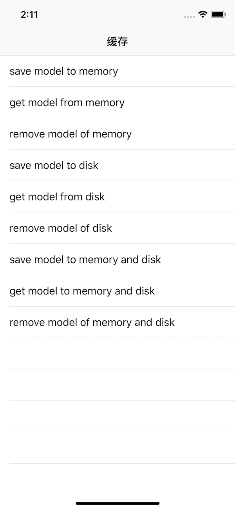

## 基于[YYCache](https://github.com/ibireme/YYCache)缓存封装

### 功能
将偏底层的`YYCache`封装成上层调用API

### 安装
#### 1.CocoaPod安装

```
pod 'MXCaches', '1.0.0'
```
#### 2.手动安装
- 在项目中添加`YYCache`，`pod 'YYCache', ' 1.0.4'`
- 把`MXCache`拖入项目

### 使用说明


```Swift
[[MXCache sharedCache] mx_mCacheCount:100 mExpirytime:3600 dExpirytime:86400 * 3];
[[MXCache sharedCache] mx_setCachePath:@""]; // 缓存路径
```

